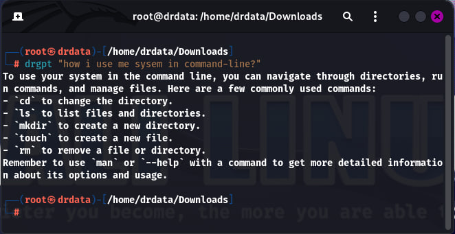
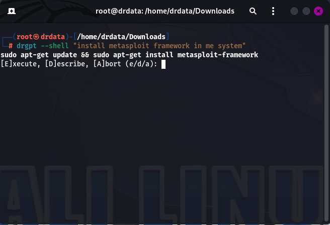
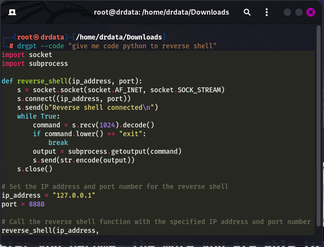

<div align="center">
  
  
  # DrGPT - Multi-Provider AI Assistant

  [](https://www.python.org/downloads/)
  [](https://opensource.org/licenses/MIT)
  [](https://github.com/psf/black)
  
  **A powerful, extensible command-line AI assistant that supports multiple AI providers**
</div>

DrGPT is designed for developers, system administrators, and power users who want intelligent assistance directly in their terminal. It supports OpenAI, Anthropic, Google, and custom APIs.

## ✨ Features

- 🤖 **Multi-Provider Support**: OpenAI (GPT-4, GPT-4o-mini), Anthropic (Claude), Google (Gemini), and custom APIs
- 💻 **Interactive Shell Commands**: Generate and execute shell commands safely with confirmation
- 🔧 **Pure Code Generation**: Generate clean code without explanations in markdown format
- 📝 **Text Editor Integration**: Use your favorite editor for complex prompt composition
- 💬 **Interactive AI Interface**: Continuous chat mode with special commands and context
- 🎨 **Rich Output**: Beautiful markdown rendering, syntax highlighting, and formatted panels
- ⚡ **Streaming Responses**: Real-time response streaming with live formatting
- ⚙️ **Highly Configurable**: Extensive configuration options with elegant status displays
- 🔐 **Secure**: Encrypted API key storage and safe command execution
- 🚀 **Fast**: Optimized for speed with animated loading indicators
- 🌐 **Cross-Platform**: Full support for Windows, macOS, and Linux

## 🚀 Quick Start

### Installation

```bash
# Install from PyPI (recommended)
pip install drgpt

# Or install from source
git clone https://github.com/DrDataYE/drgpt.git
cd drgpt
pip install -e .
```

### Updating

```bash
# Update to latest version from GitHub
drgpt --update

# Check current version
drgpt --version
```

### Basic Setup

1. **Set your API key** (choose your preferred provider):

```bash
# OpenAI (recommended for beginners)
drgpt --provider openai --api-key YOUR_OPENAI_API_KEY

# Anthropic (Claude)
drgpt --provider anthropic --api-key YOUR_ANTHROPIC_API_KEY

# Google (Gemini)
drgpt --provider google --api-key YOUR_GOOGLE_API_KEY
```

2. **Start using DrGPT**:

```bash
drgpt "Explain how Python decorators work"
```

### Environment Variables

```bash
# Windows (PowerShell)
$env:OPENAI_API_KEY = "your-api-key-here"

# Linux/macOS
export OPENAI_API_KEY="your-api-key-here"
```

## 📖 Usage Guide

### 🤖 Basic AI Queries

```bash
# General questions with beautiful markdown rendering
drgpt "What is quantum computing?"

# Get help with programming (formatted code blocks)
drgpt "How do I implement a binary search in Python?"

# System administration
drgpt "How to monitor disk usage on Linux?"
```

### 💻 Pure Code Generation

Generate clean code without explanations:

```bash
# Generate Python function (code only)
drgpt -c "Create a function to calculate fibonacci numbers"  

# Generate JavaScript code
drgpt -c "Create a React component for user authentication"  

# Generate SQL query
drgpt -c "Write a query to find top 10 customers by revenue"  
```

### 🛠️ Interactive Shell Commands

Generate and execute shell commands safely:

```bash
# Generate shell command with execution options
drgpt -s "Install Docker on Ubuntu"  

# Output shows:
# Generated Command: sudo apt-get update && sudo apt-get install docker.io
# [E]xecute, [D]escribe, [A]bort (e/d/a):
```

Options:
- **[E]xecute**: Run the command with confirmation
- **[D]escribe**: Get detailed explanation
- **[A]bort**: Cancel safely

### 📝 Text Editor Integration

Use your preferred text editor for complex prompts:

```bash
# Open editor for input composition
drgpt -e  

# Supports: VS Code, nano, vim, notepad, gedit
# Respects EDITOR and VISUAL environment variables
```

### � Terminal Integration

Setup DrGPT aliases in your terminal for seamless AI assistance:

```bash
# Setup terminal aliases (one-time setup)
drgpt -i  

# After setup, use these shortcuts directly in your terminal:
! "What is machine learning?"              # Chat with AI
s: "Install Docker on Ubuntu"              # Shell commands with execution
c: "Create a Python sorting function"      # Code generation only
e:                                          # Open editor for complex prompts
```

**How it works:**
- `!` prefix - Direct AI chat responses
- `s:` prefix - Generate shell commands with execution options
- `c:` prefix - Generate clean code without explanations  
- `e:` - Open your default editor for complex prompt composition

**Platform Support:**
- **Windows**: PowerShell profile integration
- **macOS/Linux**: Bash/Zsh profile integration
- **Fish Shell**: Native function support

**Setup is automatic** - just run `drgpt -i` once and restart your terminal!

### 🎛️ Output Options

```bash
# Disable streaming for immediate formatted output
drgpt --no-streaming "Explain machine learning concepts"

# Get plain text output (no markdown formatting)
drgpt --no-markdown "Simple explanation without formatting"

# Save response to file
drgpt -o response.md "Generate API documentation"  
```

### 🔧 Provider Management

```bash
# List all available providers and models
drgpt --list-providers

# Switch providers and models
drgpt --provider anthropic --model claude-3-sonnet

# Check current status
drgpt --status
```

### ⚙️ Advanced Usage

```bash
# Custom temperature (creativity level)
drgpt --temperature 0.8 "Write a creative story about AI"

# Limit response length
drgpt --max-tokens 500 "Summarize machine learning"

# Combine multiple options
drgpt -c --no-streaming -o functions.py "Create utility functions for file operations"  # With shortcuts

# Chat session
drgpt -ch session_1 "Let's discuss Python programming"  
```

## 🛡️ Security Features

### Safe Command Execution
- **Confirmation Required**: All shell commands require user confirmation
- **Timeout Protection**: Commands timeout after 5 minutes
- **Error Handling**: Safe execution with proper error reporting
- **Abort Option**: Easy cancellation for any command

### Secure Configuration
- **Encrypted API Keys**: Secure local storage
- **Environment Variables**: Support for env-based configuration
- **No Data Logging**: No transmission beyond chosen AI provider

## 🌐 Cross-Platform Support

| Platform | Editors | Shell | Commands |
|----------|---------|-------|----------|
| **Windows** | notepad, VS Code, Notepad++ | PowerShell, CMD | Windows-specific |
| **macOS** | VS Code, nano, vim, vi | bash, zsh | macOS-specific |
| **Linux** | VS Code, nano, vim, gedit | bash, zsh, fish | Distribution-specific |

## ⚙️ Configuration

### Configuration File

DrGPT stores configuration in `~/.config/drgpt/config`.

### Supported Providers

| Provider | Models | API Key Required |
|----------|--------|------------------|
| OpenAI | gpt-4, gpt-4o, gpt-4o-mini, gpt-3.5-turbo | Yes |
| Anthropic | claude-3-haiku, claude-3-sonnet, claude-3-opus | Yes |
| Google | gemini-pro, gemini-pro-vision | Yes |
| Custom | User-defined | Optional |

## 🔧 Development

### Setting up Development Environment

```bash
# Clone the repository
git clone https://github.com/DrDataYE/drgpt.git
cd drgpt

# Create virtual environment
python -m venv venv
source venv/bin/activate  # On Windows: venv\\Scripts\\activate

# Install in development mode
pip install -e ".[dev]"

# Run tests
python tests/test_basic.py
```

### Project Structure

```
drgpt/
├── drgpt/                  # Main package
│   ├── core/              # Core functionality
│   │   ├── config.py      # Configuration management
│   │   ├── ai_interface.py # AI provider interface
│   │   └── manager.py     # Main manager class
│   ├── cli/               # Command-line interface
│   │   └── main.py        # CLI implementation
│   └── __init__.py        # Package initialization
├── tests/                 # Test suite
├── docs/                  # Documentation
├── ADVANCED_FEATURES.md   # Detailed feature guide
├── README.md              # This file
└── setup.py              # Package setup
```


## 📷 Screenshots


*Example of interactive chat session in AI interface.*


*Example of safe shell command generation and execution.*


*Example of pure code generation in markdown output.*

## 🎯 Use Cases

## ⚡ CLI Shortcuts

DrGPT provides convenient shortcuts for frequently used options:

| Long Option | Short | Description |
|-------------|-------|-------------|
| `--code` | `-c` | Generate code only (no explanations) |
| `--shell` | `-s` | Generate shell commands with execution options |
| `--editor` | `-e` | Open text editor for input composition |
| `--interface` | `-i` | Setup terminal aliases (!, s:, c:, e:) |
| `--chat` | `-ch` | Start or continue a chat session |
| `--output` | `-o` | Save response to file |

**Examples with shortcuts:**
```bash
# Instead of: drgpt --code "Create a Python function"
drgpt -c "Create a Python function"

# Instead of: drgpt --shell "List all processes"
drgpt -s "List all processes"

# Instead of: drgpt --editor
drgpt -e

# Instead of: drgpt --interface
drgpt -i  # Setup terminal aliases

# Instead of: drgpt --output result.md "Explain AI"
drgpt -o result.md "Explain AI"

# Combine shortcuts:
drgpt -c -o code.py "Create a web scraper"
```

## 🎯 Use Cases

### For Developers
```bash
# Code generation workflow
drgpt -e        
drgpt -c "Implement user authentication with JWT"  
drgpt -c "Create database migration for user roles"  
```

### For System Administrators
```bash
# System management workflow
drgpt -s "Setup nginx with SSL certificate"  
drgpt -s "Configure automatic backups"      
drgpt -s "Monitor system performance"       
```

### For Learning and Exploration
```bash
# Interactive learning session
drgpt -i  
! What is Kubernetes?
! code: Show me a simple Kubernetes deployment
! shell: Install kubectl on my system
```

## 🤝 Contributing

We welcome contributions! Please see our [Contributing Guide](CONTRIBUTING.md) for details.

## 📄 License

This project is licensed under the MIT License - see the [LICENSE](LICENSE) file for details.

## 🎉 What's New in v2.7.1

- **Enhanced Code Mode**: Pure code generation without explanations
- **Interactive Shell**: Safe command execution with confirmations
- **Editor Integration**: Use any text editor for prompt composition
- **Interactive Interface**: Continuous chat with special commands
- **Cross-Platform**: Full Windows, macOS, and Linux support
- **Security Features**: Safe command execution and secure configuration

---

**DrGPT v2.7.1** - The most advanced command-line AI assistant for developers and power users! 🚀
